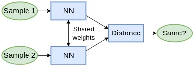
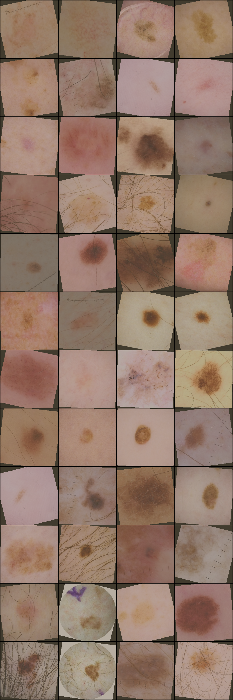
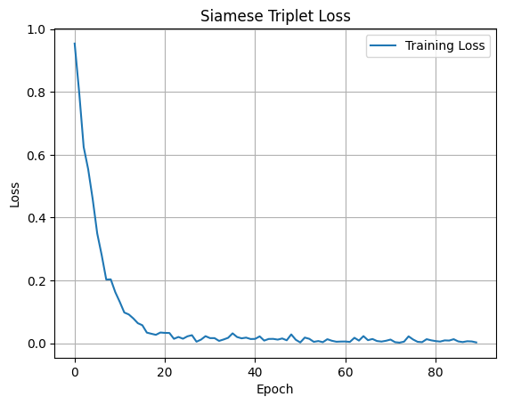
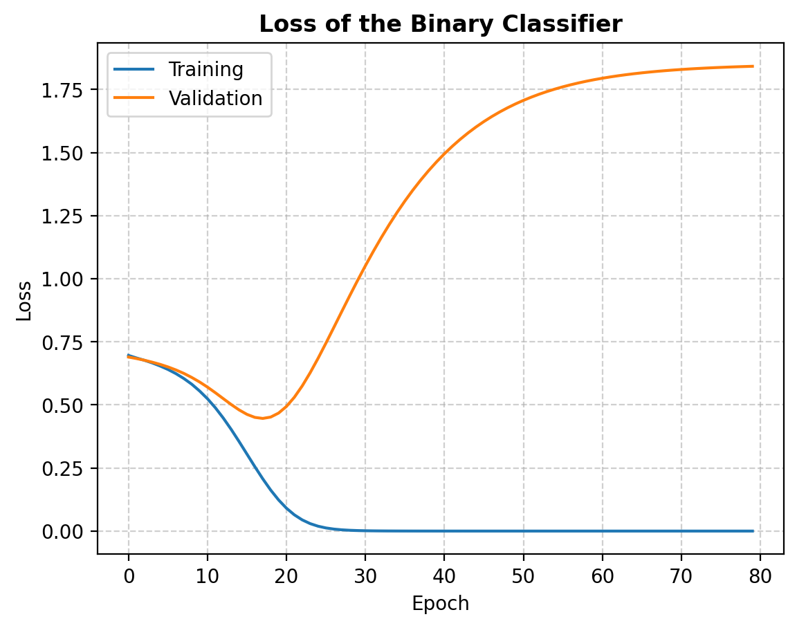
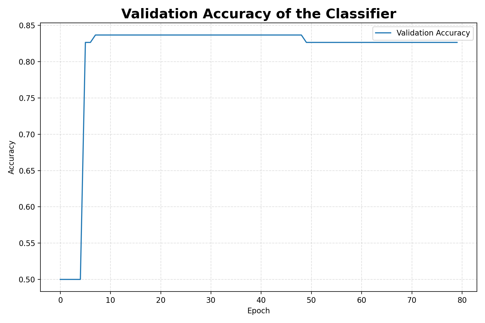
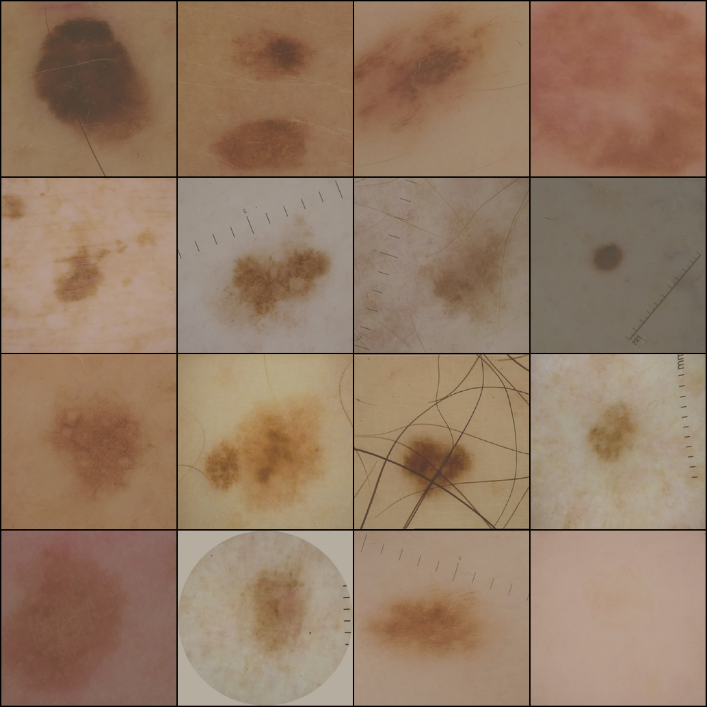

# Siamese Network for Skin Lesion Classification (ISIC 2020)

## 1. Description of the Algorithm and Problem Solved
This project implements a Siamese Neural Network for binary classification of dermoscopic skin lesion images from the ISIC 2020 dataset into benign and malignant (melanoma) classes.  
The model learns an embedding space in which visually similar lesions lie close together and dissimilar lesions lie far apart, enabling both metric learning and downstream classification.  
It corresponds to COMP3710 Pattern Analysis 2025 – Project 9 (Hard).

---

## 2. How It Works
1. **Siamese Encoder Training**  
   - The encoder is a ResNet-50 backbone with its final fully-connected layer replaced by a 1000-D projection head.  
   - It is trained using TripletMarginLoss (margin = 1.0) on batches of triplets (anchor, positive, negative).  
   - Implemented in `train_siamese()` within `train.py`.

2. **Feature Extraction and Classifier Training**  
   - The trained encoder is frozen to extract embeddings for all images.  
   - A 4-layer fully connected MLP classifier (LeakyReLU activations, CrossEntropy loss) is trained on these embeddings.  
   - Implemented in `train_classifier()` within `train.py`.

3. **Evaluation and Visualisation**  
   - `predict.py` loads checkpoints and evaluates on the test split.  
   - It prints accuracy, confusion matrix, and classification report.  

---

## 4. Example Inputs, Outputs and Plots

1. Siamese Network Architecture

---

2. Example Input Triplets

---

3. Siamese Training Loss

---

4. Classifier Training and Validation Loss

---

5. Classifier Validation Accuracy

---

6. Final Test Predictions vs Ground Truth

### Discussion

The Siamese encoder successfully learned a discriminative embedding space, as shown by the rapid drop in triplet loss.  
However, the classifier exhibited **clear overfitting**:

- The **training loss** approaches zero, while **validation loss** begins to increase after approximately 20 epochs.  
- The **validation accuracy** plateaus around **82%**, indicating moderate generalization.

This suggests that although the model effectively learns feature representations, it may **memorize specific training samples** due to the limited dataset size.

**Possible remedies:**
- Apply stronger regularization techniques (e.g., weight decay, dropout).  
- Increase the diversity of triplet sampling during training.  
- Add more aggressive data augmentation (e.g., color jitter, Gaussian blur).  
- Implement early stopping and learning rate scheduling to prevent overfitting.

### Reference

- Hadsell et al., *Dimensionality Reduction by Learning an Invariant Mapping*, CVPR 2006  
- He et al., *Deep Residual Learning for Image Recognition*, CVPR 2016  
- ISIC 2020 Challenge Dataset – https://challenge2020.isic-archive.com/  
- NischayDNK, *ISIC 2020 JPG 256x256 Resized*, Kaggle Dataset – https://www.kaggle.com/datasets/nischaydnk/isic-2020-jpg-256x256-resized/data
