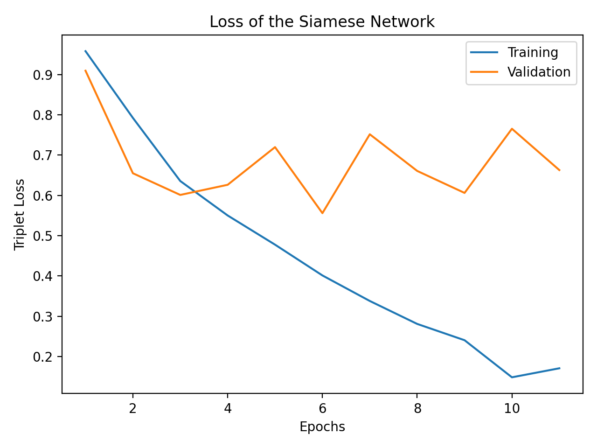
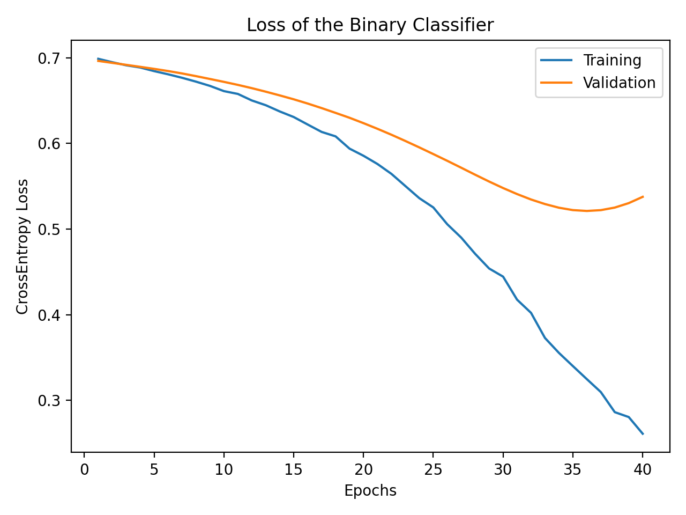
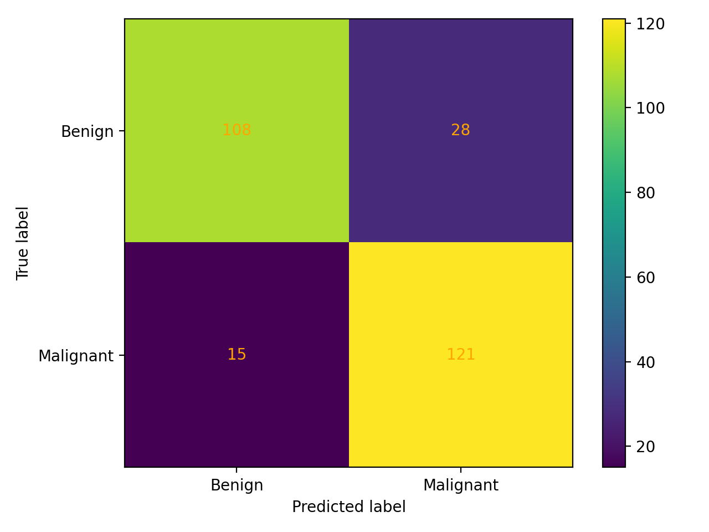
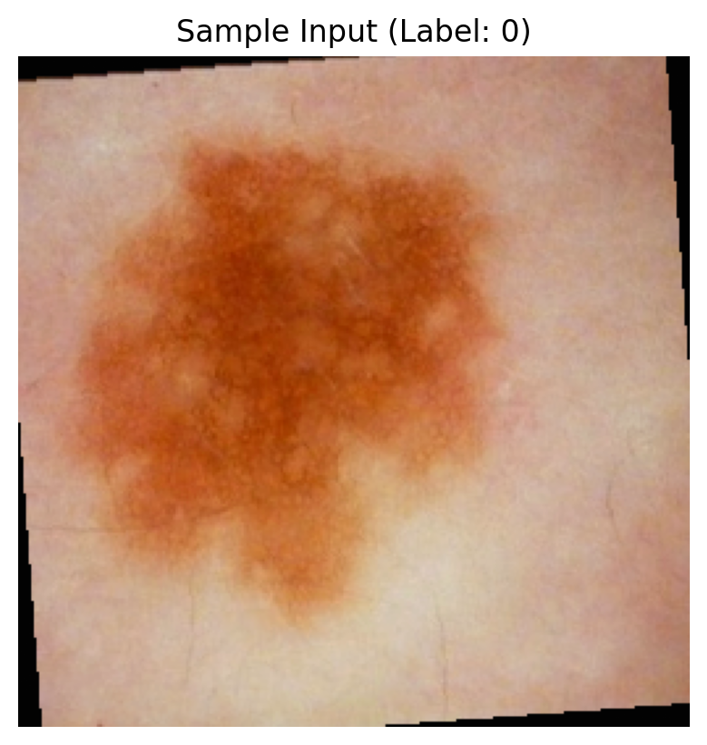

# Siamese Network for ISIC 2020 Skin Lesion Classification
**Author:** s4778251

<p align="center">
  
</p>

## Description

This repository implements a **Siamese Network** for **binary classification** of dermoscopic images from the **ISIC 2020 Challenge** dataset (melanoma vs. benign).  
The approach first trains a **Siamese encoder** using **Triplet Margin Loss** to learn a discriminative embedding space, and then trains a **binary classifier** (4-layer MLP) on top of frozen embeddings for final predictions.  
The implementation follows a modular design, with configuration centralized in `params.py`, dataset management in `dataset.py`, and the main training logic in `train.py`.


## How It Works

### Siamese Encoder
- Backbone: **ResNet-50** pretrained on ImageNet.  
- The final fully connected layer is replaced by a **512-dimensional projection head**.  
- Embeddings are **L2-normalized** to enforce metric consistency.  
- Optimized with **Triplet Margin Loss**, which minimizes the distance between anchor-positive pairs and maximizes distance to negatives.

### Binary Classifier
- Takes embeddings extracted from the Siamese encoder as input.  
- Composed of two hidden layers: 256 → 64 units.  
- Uses **LeakyReLU activation** and **Dropout (p=0.4)** for regularization.  
- Trained with **CrossEntropyLoss** to distinguish between benign and malignant samples.

### Evaluation
- After training, the encoder and classifier are evaluated on the test set.  
- The model reports overall accuracy, confusion matrix, and per-class precision, recall, and F1-score.  
- All plots (training curves, confusion matrix) are saved under `./images/`.


## Project Structure

```
siamese/
├── dataset.py          # Data loading and preprocessing pipeline
├── modules.py          # Model definitions (SiameseEncoder, BinaryClassifier)
├── train.py            # Training pipeline for Siamese and classifier networks
├── predict.py          # Evaluation and testing (confusion matrix, metrics)
├── utils.py            # Utility functions for plotting, saving samples, feature extraction, etc.
├── params.py           # Global configuration (hyperparameters, paths, augmentation, etc.)
└── models/             # Folder for saved models (.pth)
    ├── siamese.pth
    ├── classifier.pth
└── images/             # Folder for saved output figures
    ├── siamese_loss.png
    ├── classifier_loss.png
    ├── confusion_matrix.png
    └── input_sample.png
└── dataset/            # Dataset
    ├── train-image/
    ├── train-metadata.csv 
```


## File Explanations

- **params.py** – Stores all global variables and hyperparameters, including dataset paths, image preprocessing, model dimensions, and training settings.  
- **dataset.py** – Defines dataset classes, data augmentation, and loaders for both triplet and classification tasks.  
- **modules.py** – Contains the model definitions: the Siamese encoder (ResNet-50) and binary classifier (4-layer MLP).  
- **utils.py** – Includes helper functions for plotting, saving figures, feature extraction, and directory creation.  
- **train.py** – Main training script that trains the Siamese encoder, extracts embeddings, and trains the classifier.  
- **predict.py** – Evaluation script that loads trained models, computes predictions, and saves the confusion matrix.


## Dependencies
```
Tested on Google Colab (CUDA 12.6).

| Package        | Version        |
|----------------|----------------|
| torch          | 2.8.0+cu126    |
| torchvision    | 0.23.0+cu126   |
| numpy          | 2.0.2          |
| pandas         | 2.2.2          |
| matplotlib     | 3.10.0         |
| scikit-learn   | 1.6.1          |
```


## Data Preprocessing

- Input: **256×256 RGB** dermoscopic images (`train-image/`)  
- Metadata: `train-metadata.csv` (containing `isic_id`, `patient_id`, `target`)  
- Split: **70% train / 10% validation / 20% test**, grouped by patient ID to prevent data leakage.  
- Normalization: `mean = [0.5, 0.5, 0.5]`, `std = [0.5, 0.5, 0.5]`.  
- Augmentation: random rotations, color jitter, horizontal/vertical flips.  

All preprocessing configurations and split ratios are defined in `params.py` for reproducibility.

### Justification of Data Splits
A 70 / 10 / 20 (train / validation / test) split was selected to maintain a balance between model generalization and evaluation stability.  
Group-based splitting by `patient_id` prevents data leakage between training and test sets, as multiple images can originate from the same patient.  


## Training and Testing

All experiments were conducted in **Google Colab A100**.  
Before running, ensure that the working directory is correctly set to the project folder.


### Train Both Networks
%cd /content/siamese
!python train.py

#### This command will:
- Train the Siamese encoder using **Triplet Margin Loss**  
- Extract embeddings from the encoder  
- Train the binary classifier using **CrossEntropyLoss**  
- Save model weights and training plots under `./models/` and `./images/`


### Evaluate on Test Set
%cd /content/siamese
!python predict.py

#### This command loads the trained models and:
- Evaluates performance on the test dataset
- Computes accuracy, precision, recall, and F1-score
- Generates and saves the confusion matrix as `./images/confusion_matrix.png`


## Visual Results

**1. Siamese Network Training Loss**  
<p align="center">
  
</p>
The triplet loss of the Siamese encoder steadily decreases during training, showing that the network effectively learns to minimize distances between similar image pairs while separating dissimilar ones.

---

**2. Binary Classifier Loss**  
<p align="center">
  
</p>
The CrossEntropy loss for both training and validation sets consistently declines, indicating stable convergence.  
Validation loss flattens near the end, suggesting moderate generalization with minimal overfitting.

---

**3. Confusion Matrix**  
<p align="center">
  
</p>
The confusion matrix demonstrates that the classifier correctly identifies most benign and malignant lesions.  
Diagonal dominance confirms strong predictive performance and well-learned decision boundaries.

---

**Sample Input Example**  
<p align="center">
  
</p>
This sample dermoscopic image was randomly **rotated** and **color-adjusted** as part of data augmentation.  
Such transformations increase dataset diversity and improve model robustness to variations in image orientation and illumination.


## Training & Evaluation Logs

Below are condensed console outputs from **train.py** and **predict.py**.  
They demonstrate proper training convergence, early stopping, and final evaluation results.

### Training Log (`train.py`)
The Siamese encoder stops early due to validation loss plateauing,  
while the classifier converges smoothly to around **82% validation accuracy**.

```
Device: cuda
[INFO] Loaded 33126 samples from train-metadata.csv
[Siamese] Epoch 1/100 train_loss=0.9653 val_loss=0.8922
[Siamese] Epoch 2/100 train_loss=0.8287 val_loss=0.6524
[Siamese] Epoch 3/100 train_loss=0.6778 val_loss=0.6933
[Siamese] Epoch 4/100 train_loss=0.5562 val_loss=0.6903
.
.
.
[Siamese] Early stopping at epoch 14
[INFO] Saved final Siamese encoder (stopped model).
[INFO] Extracting embeddings...
[Extract] 100.0% complete
[CLS] Epoch 1/80 train_loss=0.6952 val_loss=0.6876 val_acc=50.00%
[CLS] Epoch 5/80 train_loss=0.6495 val_loss=0.6600 val_acc=50.00%
[CLS] Epoch 10/80 train_loss=0.5977 val_loss=0.6255 val_acc=81.63%
[CLS] Epoch 20/80 train_loss=0.4247 val_loss=0.5239 val_acc=81.63%
[CLS] Epoch 28/80 train_loss=0.2580 val_loss=0.4580 val_acc=82.65%
[CLS] Epoch 33/80 train_loss=0.1685 val_loss=0.4575 val_acc=82.65%
[CLS] Early stopping at epoch 35
[INFO] Saved final classifier (stopped model).
[INFO] Training finished. All results saved to ./images
```


### Evaluation Log (`predict.py`)
After loading trained models, the classifier achieved 81% test accuracy with balanced precision and recall.

```
/content/siamese
Device: cuda
[INFO] Loaded 33126 samples from train-metadata.csv
[INFO] Extracting test features...
[Extract] 100.0% complete
[TEST] Accuracy: 80.51%
[TEST] Confusion Matrix:
 [[113  23]
 [ 30 106]]

[TEST] Classification Report:
               precision    recall  f1-score   support
   benign(0)       0.80      0.82      0.81       136
malignant(1)       0.81      0.79      0.80       136
    accuracy                           0.81       272
   macro avg       0.81      0.81      0.81       272
weighted avg       0.81      0.81      0.81       272

[INFO] Saved confusion_matrix.png to: ./images
```


## Discussion and Future Work

The Siamese encoder successfully learned a discriminative embedding space, as reflected by the steadily decreasing triplet loss during training.  
However, the validation loss showed noticeable oscillation, suggesting that the triplet sampling strategy may not consistently produce informative anchor–positive–negative pairs.  
While the classifier achieved stable convergence and balanced performance (precision and recall ≈ 0.8), the overall accuracy plateaued around 81–82%, indicating that generalization to unseen samples remains limited.

Several factors may explain these observations:
- The dataset exhibits **class imbalance** and **intra-class variability**, which can make triplet formation unstable.  
- The **triplet margin** and **sampling strategy** were fixed throughout training, potentially limiting the diversity of hard examples.  

**Future Work**
- Implement **hard or semi-hard negative mining** to improve triplet selection and reduce validation fluctuation.  
- Explore **alternative metric learning losses** (e.g., ArcFace, Contrastive Loss) to enhance inter-class margins and improve embedding quality.


## References

1. **ISIC 2020 Challenge Dataset** – *SIIM-ISIC Melanoma Classification* (Kaggle):  
   https://www.kaggle.com/datasets/nischaydnk/isic-2020-jpg-256x256-resized/data  

2. **Triplet Margin Loss (PyTorch Documentation)** –  
   https://pytorch.org/docs/stable/generated/torch.nn.TripletMarginLoss.html  

3. **CrossEntropy Loss (PyTorch Documentation)** –  
   https://pytorch.org/docs/stable/generated/torch.nn.CrossEntropyLoss.html  

4. **G. Koch, R. Zemel, R. Salakhutdinov et al.**,  
   *Siamese Neural Networks for One-Shot Image Recognition*,  
   in *ICML Deep Learning Workshop*, 2015.  
